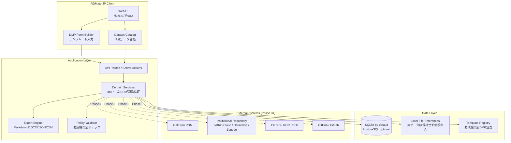

# 00. プロジェクト全体像・アーキテクチャ概要

> RDMate JP — 日本の大学・研究機関向けオープンソース DMP Builder + Research Data Manager Lite
> License: MIT / Status: Planning

---

## 1. プロジェクトの目的

`RDMate JP` は、大学・研究機関の基礎研究を対象に、**データ管理計画（DMP: Data Management Plan）の作成**と、研究プロジェクト単位の**研究データ管理（RDM: Research Data Management）**を軽量に支援するオープンソースアプリケーションである。

研究者・大学院生・URA・図書館員・研究推進部門が、助成金申請時から研究終了後のデータ公開・保存までを一貫して扱えるようにする。

### 解決したい課題

- DMP が Word/Excel/メール添付で分散し、研究データ・論文・助成金情報と結び付かない。
- 研究データの保存場所、公開可否、メタデータ、ライセンス、保持期間が研究室ごとに属人的に管理される。
- JST/AMED/科研費/NIH など、助成機関ごとの DMP 記載要件に合わせた再利用可能なテンプレートが不足している。
- NII Research Data Cloud / GakuNin RDM / JAIRO Cloud / Dataverse / Zenodo など外部基盤へ渡すメタデータを後から整える負担が大きい。
- 研究終了時に、データ公開可否・匿名化要否・ライセンス・DOI・関連論文・ソフトウェアの対応関係を確認しづらい。

---

## 2. ターゲットユーザー

| セグメント | 主な利用シーン | 必要な価値 |
|------------|----------------|------------|
| 研究代表者（PI） | 助成金申請、研究終了報告、データ公開判断 | DMP を短時間で作成し、研究成果と紐付けたい |
| 大学院生・ポスドク | 日常のデータ整理、論文投稿前の再現性チェック | データ・コード・手順・ライセンスを迷わず整理したい |
| URA・研究推進部門 | 研究者への DMP 作成支援、助成金要件チェック | 複数プロジェクトのDMP品質を標準化したい |
| 大学図書館・リポジトリ担当 | メタデータ付与、機関リポジトリ登録支援 | 公開用メタデータを構造化して受け取りたい |
| 小規模研究室 | ローカル/学内環境での簡易RDM | 大規模RDM基盤を導入せずに最低限の管理を始めたい |

技術的前提：研究者は非エンジニアでも使える GUI を重視する。OSS貢献者・大学情報基盤担当者は CLI/API で拡張できる構造にする。

---

## 3. プロダクトスコープ

### MVP で実現すること

1. 研究課題・助成金・研究チームの登録
2. DMP テンプレート選択とフォーム入力
3. 研究データセット台帳の作成
4. データ種別・保存場所・公開区分・ライセンス・保持期間の管理
5. Markdown / DOCX / JSON / CSV 形式のエクスポート
6. DMP とデータセットの整合性チェック

### MVP ではやらないこと

- 実データファイルの大容量ストレージ提供
- IRB/倫理審査システムそのものの代替
- 電子実験ノートの完全代替
- GakuNin RDM や JAIRO Cloud の公式 API クライアント実装
- 個人情報・要配慮情報の自動匿名化

---

## 4. 競合・周辺ツール比較

| 項目 | 汎用表計算/Word | 機関RDM基盤 | DMPonline等 | **RDMate JP** |
|------|-----------------|-------------|-------------|---------------|
| DMP作成 | 手作業 | 機関に依存 | 強い | **日本向けテンプレートを内蔵** |
| 研究データ台帳 | 弱い | 強い | 弱い | **DMPと一体管理** |
| ローカル導入 | 可 | 難しい | SaaS中心 | **ローカル/学内サーバ両対応** |
| OSS改変 | 不可/困難 | 基盤次第 | 限定的 | **MITで自由に拡張** |
| 日本語UI | 可 | 基盤次第 | 限定的 | **日本語ファースト** |
| 外部基盤連携 | 手作業 | 強い | 限定的 | **段階的に連携** |

---

## 5. システム全体アーキテクチャ

---

## 6. 技術スタック選定

| レイヤ | 採用技術 | 選定理由 |
|--------|----------|----------|
| フロントエンド | Next.js + React + TypeScript | Webアプリとして導入しやすく、将来の学内サーバ運用にも対応しやすい |
| UI | Tailwind CSS + shadcn/ui | 管理画面・フォーム・テーブル中心のUIを短期間で構築できる |
| バックエンド | Next.js Route Handlers / Server Actions | MVPでは単一TypeScriptスタックで開発速度を優先 |
| DB | SQLite（既定）/ PostgreSQL（任意） | 小規模研究室はローカル、機関運用はPostgreSQLへ移行可能 |
| ORM | Prisma または Drizzle | 型安全なDBアクセス、マイグレーション管理 |
| バリデーション | Zod | フォーム・API・テンプレート定義を共通検証 |
| エクスポート | Markdown / JSON / CSV / DOCX | 申請書貼り付け、機関提出、機械可読性を両立 |
| テスト | Vitest / Playwright | ドメインロジックと主要UIフローを自動検証 |
| 配布 | Docker Compose / Node.js / 将来Tauri | 研究室PC・学内VM・デスクトップ配布へ段階対応 |

---

## 7. フェーズ構成サマリー

| フェーズ | テーマ | 主要成果物 | 関連ドキュメント |
|----------|--------|------------|------------------|
| Phase 1 | MVP：DMP Builder | プロジェクト登録、DMPテンプレート、基本エクスポート | `01_phase1_mvp.md` |
| Phase 2 | RDM Lite：研究データ台帳 | データセット管理、保存場所、公開区分、メタデータ検証 | `02_phase2_rdm_lite.md` |
| Phase 3 | テンプレート・外部連携 | 助成機関別テンプレート、GakuNin RDM/リポジトリ連携設計 | `03_phase3_templates_integrations.md` |
| Phase 4 | 運用・OSS化 | 認証、監査ログ、Docker、CI、ドキュメント、貢献導線 | `04_phase4_operations_oss.md` |

データモデルは `05_data_models.md`、実装タスク一覧は `06_task_list.md` を参照。

---

## 8. 主要ユースケース

### 8.1 助成金申請前のDMP作成

1. 研究課題を登録する。
2. 助成機関テンプレートを選択する。
3. データ種別、保存場所、公開方針、ライセンス、保持期間を入力する。
4. 不足項目チェックを実行する。
5. Markdown / DOCX で出力し、申請書へ転記する。

### 8.2 研究期間中のデータ管理

1. データセットを登録する。
2. 保存場所、責任者、アクセス権、バージョン、関連コードを紐付ける。
3. 公開可否・公開予定日・匿名化要否を更新する。
4. DMPとの差分を確認する。

### 8.3 論文投稿・研究終了時の公開準備

1. 論文、データセット、コード、DOI、ライセンスを関連付ける。
2. 公開不可データの理由を記録する。
3. リポジトリ登録用メタデータをJSON/CSVで出力する。
4. 再現性チェックリストを作成する。

---

## 9. 外部参照・政策背景

- NII RCOS: GakuNin RDM（研究データ管理基盤） — https://rcos.nii.ac.jp/service/rdm/
- NII Research Data Cloud — https://rcos.nii.ac.jp/
- NIH Data Management and Sharing Policy — https://grants.nih.gov/policy-and-compliance/policy-topics/sharing-policies/dms
- 内閣府: AI for Science・オープンサイエンス — https://www8.cao.go.jp/cstp/kenkyudx.html
- RDMkit-jp — https://rdmkit.rcos.nii.ac.jp/

---

## 10. 成功指標

| 指標 | MVP目標 |
|------|---------|
| DMP作成時間 | 30分以内で初版を作成できる |
| 入力再利用率 | DMP入力項目の70%以上を研究データ台帳へ再利用できる |
| エクスポート形式 | Markdown / JSON / CSV / DOCX に対応 |
| テンプレート | 汎用、日本語大学向け、NIH風の3種類以上 |
| テスト | ドメインロジック主要分岐のユニットテストを整備 |
| OSS導線 | README、CONTRIBUTING、Issue template を整備 |
