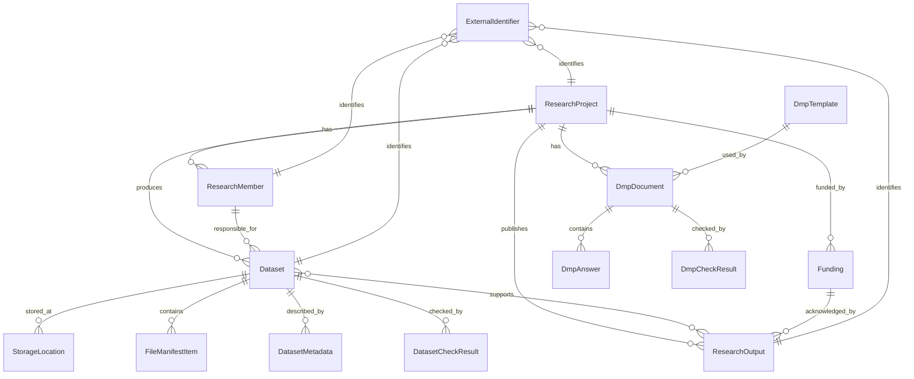

# 05. データモデル設計

> RDMate JP の DMP Builder / RDM Lite / 外部連携を支える主要エンティティと関係を定義する。

---

## 1. 設計方針

- 研究課題を中心に、DMP、データセット、メタデータ、成果物、助成金、研究メンバーを関連付ける。
- 実データファイルは原則保持せず、保存場所・外部URL・マニフェスト・ハッシュ等の参照情報を管理する。
- DMPテンプレートはバージョン管理し、過去に作成したDMPの再現性を保つ。
- JSONエクスポートでプロジェクト全体を移行・バックアップできるようにする。
- SQLite と PostgreSQL の両方で扱いやすいスキーマにする。

---

## 2. ER図



---

## 3. 主要テーブル

## 3.1 `research_projects`

| カラム | 型 | 必須 | 説明 |
|--------|----|------|------|
| id | uuid | yes | 主キー |
| title_ja | text | yes | 研究課題名（日本語） |
| title_en | text | no | 研究課題名（英語） |
| description | text | no | 研究概要 |
| discipline | text | no | 研究分野 |
| start_date | date | no | 開始日 |
| end_date | date | no | 終了予定日 |
| status | enum | yes | draft / active / completed / archived |
| data_steward_member_id | uuid | no | データ管理責任者 |
| created_at | datetime | yes | 作成日時 |
| updated_at | datetime | yes | 更新日時 |

---

## 3.2 `research_members`

| カラム | 型 | 必須 | 説明 |
|--------|----|------|------|
| id | uuid | yes | 主キー |
| project_id | uuid | yes | 研究課題ID |
| name_ja | text | yes | 氏名（日本語） |
| name_en | text | no | 氏名（英語） |
| email | text | no | メール |
| affiliation | text | no | 所属 |
| department | text | no | 部局・研究科 |
| role | enum | yes | pi / co_i / data_steward / student / collaborator / viewer |
| orcid | text | no | ORCID iD |
| created_at | datetime | yes | 作成日時 |
| updated_at | datetime | yes | 更新日時 |

---

## 3.3 `fundings`

| カラム | 型 | 必須 | 説明 |
|--------|----|------|------|
| id | uuid | yes | 主キー |
| project_id | uuid | yes | 研究課題ID |
| funder_name | text | yes | 助成機関名 |
| program_name | text | no | 助成プログラム名 |
| grant_number | text | no | 課題番号 |
| fiscal_year | text | no | 年度 |
| url | text | no | 助成情報URL |
| start_date | date | no | 助成開始日 |
| end_date | date | no | 助成終了日 |
| created_at | datetime | yes | 作成日時 |
| updated_at | datetime | yes | 更新日時 |

---

## 3.4 `dmp_templates`

| カラム | 型 | 必須 | 説明 |
|--------|----|------|------|
| id | text | yes | テンプレートID |
| name | text | yes | テンプレート名 |
| version | text | yes | バージョン |
| locale | text | yes | ja / en |
| target_funder | text | no | 対象助成機関 |
| target_discipline | text | no | 対象分野 |
| source_url | text | no | 参照元URL |
| schema_json | json | yes | セクション・設問定義 |
| rules_json | json | no | チェックルール |
| is_deprecated | boolean | yes | 非推奨フラグ |
| last_reviewed_at | date | no | 最終確認日 |
| created_at | datetime | yes | 作成日時 |
| updated_at | datetime | yes | 更新日時 |

---

## 3.5 `dmp_documents`

| カラム | 型 | 必須 | 説明 |
|--------|----|------|------|
| id | uuid | yes | 主キー |
| project_id | uuid | yes | 研究課題ID |
| template_id | text | yes | 使用テンプレートID |
| template_version | text | yes | 使用テンプレートバージョン |
| title | text | yes | DMPタイトル |
| status | enum | yes | draft / reviewed / approved / exported / archived |
| language | text | yes | ja / en |
| version | integer | yes | DMP文書バージョン |
| created_at | datetime | yes | 作成日時 |
| updated_at | datetime | yes | 更新日時 |

---

## 3.6 `dmp_answers`

| カラム | 型 | 必須 | 説明 |
|--------|----|------|------|
| id | uuid | yes | 主キー |
| dmp_document_id | uuid | yes | DMP文書ID |
| section_id | text | yes | セクションID |
| question_id | text | yes | 設問ID |
| answer_json | json | no | 回答値 |
| answer_text | text | no | 検索用テキスト |
| is_auto_filled | boolean | yes | 自動補完フラグ |
| updated_by | uuid | no | 更新者 |
| created_at | datetime | yes | 作成日時 |
| updated_at | datetime | yes | 更新日時 |

---

## 3.7 `datasets`

| カラム | 型 | 必須 | 説明 |
|--------|----|------|------|
| id | uuid | yes | 主キー |
| project_id | uuid | yes | 研究課題ID |
| name | text | yes | データセット名 |
| description | text | no | 説明 |
| data_type | enum | yes | experimental / observational / simulation / survey / image / text / code / processed / other |
| responsible_member_id | uuid | no | 責任者 |
| status | enum | yes | planned / collecting / processing / ready / published / archived |
| version | text | no | バージョン |
| created_date | date | no | 作成日 |
| updated_date | date | no | 更新日 |
| access_level | enum | yes | open / embargoed / restricted / closed / undecided |
| embargo_until | date | no | エンバーゴ解除日 |
| license | text | no | ライセンス |
| non_public_reason | text | no | 非公開理由 |
| doi | text | no | DOI |
| public_url | text | no | 公開URL |
| created_at | datetime | yes | 作成日時 |
| updated_at | datetime | yes | 更新日時 |

---

## 3.8 `storage_locations`

| カラム | 型 | 必須 | 説明 |
|--------|----|------|------|
| id | uuid | yes | 主キー |
| dataset_id | uuid | yes | データセットID |
| location_type | enum | yes | local_path / network_drive / cloud_url / gakunin_rdm / repository / github / other |
| label | text | no | 表示名 |
| uri | text | yes | パスまたはURL |
| access_scope | enum | no | private / lab / institution / public |
| backup_enabled | boolean | no | バックアップ有無 |
| notes | text | no | 備考 |
| created_at | datetime | yes | 作成日時 |
| updated_at | datetime | yes | 更新日時 |

---

## 3.9 `file_manifest_items`

| カラム | 型 | 必須 | 説明 |
|--------|----|------|------|
| id | uuid | yes | 主キー |
| dataset_id | uuid | yes | データセットID |
| relative_path | text | yes | 相対パス |
| file_name | text | yes | ファイル名 |
| size_bytes | integer | no | サイズ |
| mime_type | text | no | MIMEタイプ |
| checksum_algorithm | text | no | sha256等 |
| checksum | text | no | ハッシュ値 |
| last_modified_at | datetime | no | 更新日時 |
| created_at | datetime | yes | 作成日時 |

---

## 3.10 `dataset_metadata`

| カラム | 型 | 必須 | 説明 |
|--------|----|------|------|
| id | uuid | yes | 主キー |
| dataset_id | uuid | yes | データセットID |
| title | text | yes | タイトル |
| description | text | no | 説明 |
| keywords_json | json | no | キーワード |
| creators_json | json | no | 作成者 |
| contributors_json | json | no | 貢献者 |
| temporal_coverage | text | no | 時間範囲 |
| spatial_coverage | text | no | 空間範囲 |
| methodology | text | no | 取得・生成方法 |
| variables_json | json | no | 変数・カラム説明 |
| rights | text | no | 権利情報 |
| citation | text | no | 引用方法 |
| created_at | datetime | yes | 作成日時 |
| updated_at | datetime | yes | 更新日時 |

---

## 3.11 `research_outputs`

| カラム | 型 | 必須 | 説明 |
|--------|----|------|------|
| id | uuid | yes | 主キー |
| project_id | uuid | yes | 研究課題ID |
| output_type | enum | yes | article / preprint / conference / software / dataset / protocol / other |
| title | text | yes | 成果物タイトル |
| url | text | no | URL |
| doi | text | no | DOI |
| repository_url | text | no | コードリポジトリ等 |
| license | text | no | ライセンス |
| publication_year | integer | no | 出版年 |
| citation | text | no | 引用情報 |
| created_at | datetime | yes | 作成日時 |
| updated_at | datetime | yes | 更新日時 |

---

## 3.12 `external_identifiers`

| カラム | 型 | 必須 | 説明 |
|--------|----|------|------|
| id | uuid | yes | 主キー |
| entity_type | text | yes | project / member / dataset / output / institution |
| entity_id | uuid | yes | 対象ID |
| identifier_type | enum | yes | orcid / ror / doi / url / grant_id / other |
| identifier_value | text | yes | 識別子 |
| resolver_url | text | no | 解決URL |
| created_at | datetime | yes | 作成日時 |

---

## 3.13 `check_results`

| カラム | 型 | 必須 | 説明 |
|--------|----|------|------|
| id | uuid | yes | 主キー |
| project_id | uuid | yes | 研究課題ID |
| target_type | enum | yes | dmp / dataset / project / export |
| target_id | uuid | yes | 対象ID |
| rule_id | text | yes | ルールID |
| severity | enum | yes | error / warning / info |
| message | text | yes | メッセージ |
| status | enum | yes | open / ignored / resolved |
| created_at | datetime | yes | 作成日時 |
| resolved_at | datetime | no | 解決日時 |

---

## 3.14 `audit_logs`

| カラム | 型 | 必須 | 説明 |
|--------|----|------|------|
| id | uuid | yes | 主キー |
| actor_user_id | uuid | no | 操作者 |
| action | text | yes | 操作名 |
| entity_type | text | yes | 対象種別 |
| entity_id | uuid | no | 対象ID |
| summary | text | no | 概要 |
| diff_json | json | no | 変更差分 |
| created_at | datetime | yes | 作成日時 |

---

## 4. Enum定義

### 4.1 `project_status`

```text
draft
active
completed
archived
```

### 4.2 `dmp_status`

```text
draft
reviewed
approved
exported
archived
```

### 4.3 `dataset_status`

```text
planned
collecting
processing
ready
published
archived
```

### 4.4 `access_level`

```text
open
embargoed
restricted
closed
undecided
```

### 4.5 `member_role`

```text
pi
co_i
data_steward
student
collaborator
viewer
admin
```

---

## 5. エクスポートJSON構造

```json
{
  "schema_version": "1.0.0",
  "exported_at": "2026-01-01T00:00:00Z",
  "project": {},
  "members": [],
  "fundings": [],
  "dmp_documents": [
    {
      "document": {},
      "answers": [],
      "check_results": []
    }
  ],
  "datasets": [
    {
      "dataset": {},
      "metadata": {},
      "storage_locations": [],
      "file_manifest": [],
      "check_results": []
    }
  ],
  "outputs": [],
  "external_identifiers": []
}
```

---

## 6. インデックス設計

- `research_projects.status`
- `research_projects.updated_at`
- `research_members.project_id`
- `fundings.project_id`
- `dmp_documents.project_id`
- `dmp_documents.template_id`
- `dmp_answers.dmp_document_id`
- `datasets.project_id`
- `datasets.access_level`
- `datasets.status`
- `storage_locations.dataset_id`
- `file_manifest_items.dataset_id`
- `research_outputs.project_id`
- `external_identifiers.entity_type, entity_id`
- `check_results.project_id, target_type, target_id`
- `audit_logs.entity_type, entity_id`

---

## 7. マイグレーション方針

- Phase 1ではDMP Builderに必要な最小テーブルから開始する。
- Phase 2でDataset / StorageLocation / Metadataを追加する。
- Phase 3でExternalIdentifier / Connector関連テーブルを追加する。
- Phase 4でUser / Permission / AuditLogを本格化する。
- 破壊的変更を避け、テンプレート・DMP回答はバージョンで互換性を維持する。
